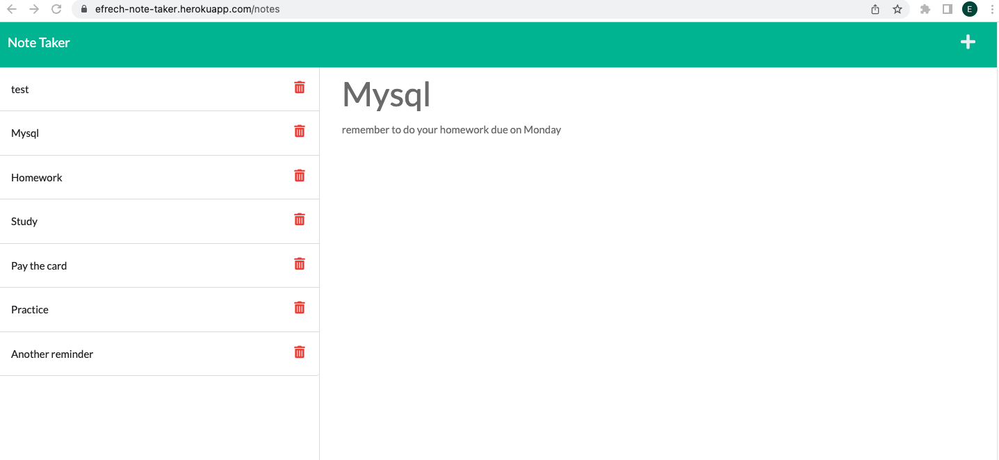

# note-taker 📓
This application can be used to write, save and delete notes. This app uses an Express.js back end and saves and retrieves note data from a JSON file.


## User Story

```
AS A small business owner
I WANT to be able to write, save & delete notes
SO THAT I can organize my thoughts and keep track of tasks I need to complete
```


## App functionality 

```
When the Note Taker application its opened,  
The user is presented with a landing page with a link to a notes page,
When clicking on the link to the notes page,
The user is presented with a page with existing notes listed in the left-hand column, plus empty fields to enter a new note title and the note’s text in the right-hand column,
When the user enters a new note title and the note’s text,
A Save icon appears in the navigation at the top of the page,
When clicking on the Save icon,
The new note entered is saved and appears in the left-hand column with the other existing notes,
Then, when clicking on an existing note in the list in the left-hand column,
That note appears in the right-hand column,
When clicking on the Write icon in the navigation at the top of the page,
The user is presented with empty fields to enter a new note title and the note’s text in the right-hand column,
There is also a delete option to delete selected note from data base and app. 
```


## Mock-Up

The following images show the web application's appearance and functionality:




## Deployment 🚀

| Description   | URL's                                    |
| ------------- | -------------                            |
| Deployed App  | https://efrech-note-taker.herokuapp.com/ |
| Repositiry    | https://github.com/efrech/note-taker     |
